# Family Favorites

## CONTENT

* [OBJECTIVES](<#objectives>)
* [FEATURES](<#features>)
    * [The main page](<#the-main-page>)
    * [Main options menu](<#main-options-menu>)
    * [Check recipes](<#check-recipes>)
    * [Add new recipe](<#add-new-recipe>)
    * [Future Features](<#future-features>)

* [LOGIC](<#logic>)

* [DESIGN](<#design>)

* [USER EXPERIENCE](<#user-experience-ux>)

* [TESTING](<#testing>)
    * [Code Validation](<#code-validation>)
    * [Manual Testing](<#manual-testing>)

* [DEPLOYMENT](<#deployment>)
    
* [CREDITS](<#credits>)
	* [Colleagues](<#colleagues>)
	* [Websites](<#websites>)

## OBJECTIVES

Family Favorites is a python terminal family recipe book that runs in the Code Institute terminal on Heroku. It allows the users to check or add their favorite recipes in the book. This is a special project as I noticed that my family has a lot of recipes and each person has a different favorite one. It will allow us to save those recipes for the next generations and never let them get lost.

You can see the deployed project [here](https://family-favorites-0f04df5192e9.herokuapp.com/) 

## FEATURES

### The main page
* The main page contains an ASCII art with the name of the digital recipe book using 
[Patorjk](https://patorjk.com/).

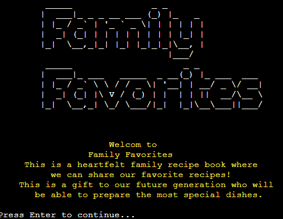

* It also contains a little explanation about what this is about.

### Main options menu
* This is the main options menu. It gives the user the option to add or check a recipe. 
* These are the main options the user has.

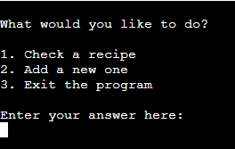

### Check recipes

* This is the check recipes menu. It allows the user to check a recipe that is already in the recipe book.

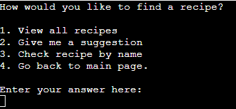

* View all recipes - returns a table with all recipes in the spreadsheet.

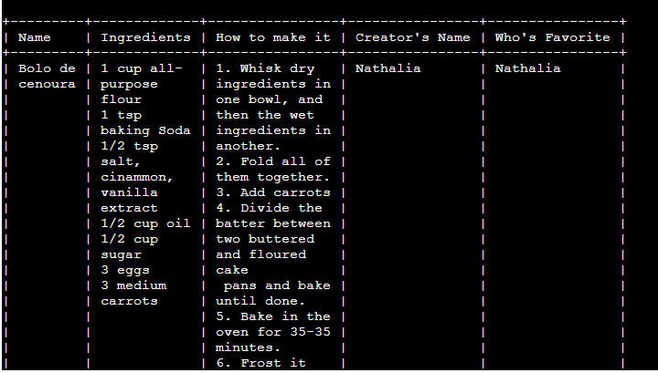

* Suggestion recipe - returns a random recipe from the spreadsheet. It also gives the user the option to get a new random suggestion.

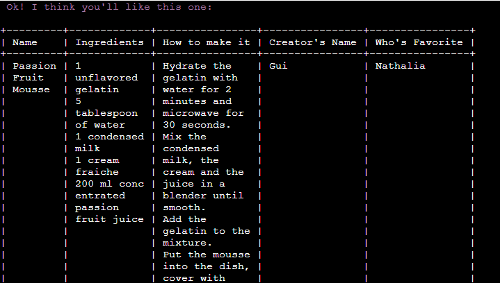

* Search recipe by name - returns all recipes with the name the user entered (or informs the user that there’s no recipe with that name).

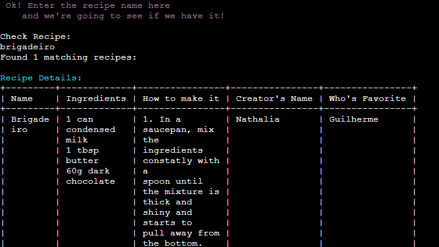

### Add new recipe
* Gives the user the option to add a new recipe to the book by getting some information about the new recipe.

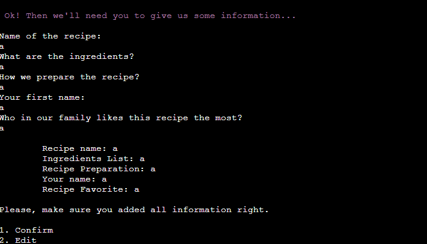

* If the user confirms the information entered, then the spreadsheet is updated.

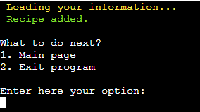

* If the user wants to edit some information entered, he can enter the edit option as many times as necessary.

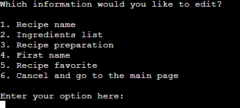

### Next move function
* This function appears after every “end” of an option so the user can choose to go back to the main page (to do some other thing) or to exit the program if he’s finished.

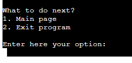

### Future features
In the future, the user will be able to:
* Delete a recipe from the recipe book;
* Edit existing recipes;
* Search recipes by ingredients, type (savoury or sweet), etc.

## LOGIC
See below flow chart from [Lucid Chart](https://www.lucidchart.com/) to understand the logic of the code. The colours in the chart are:
* Blue background - main options menu
* Yellow background - options the user can choose
* Green text - the result of all options entered by the user
* Red background - cancel or/and go to main page or/and exit the program
* Orange text - gets data from the user

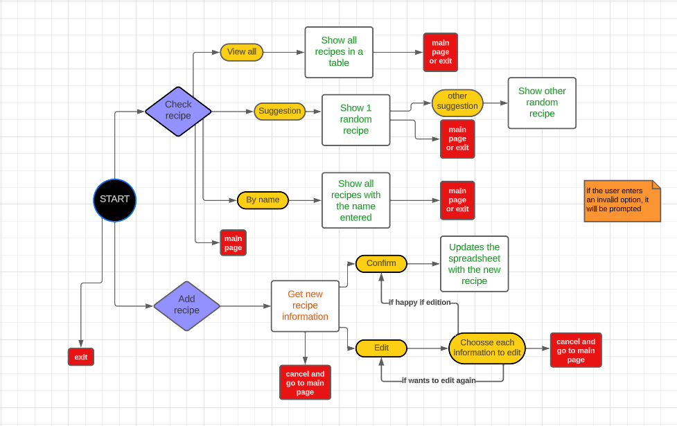

## DESIGN

### Colors
I added some colors to the console so it’s easier for the user to recognize some options and results.
* Red - warning errors or exit the program
* Yellow - loading information
* Purple - interaction with the user 
* Cyan - details of the recipe
* Green - updates completed

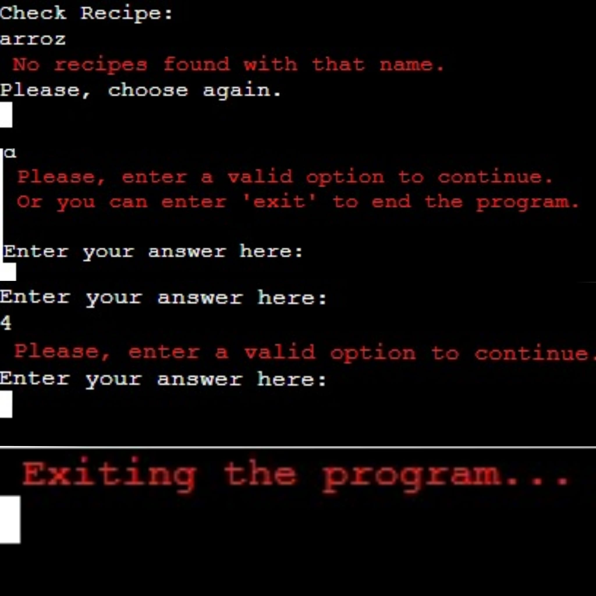

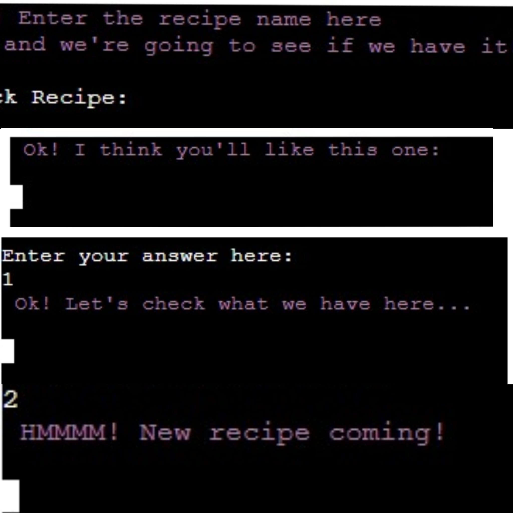

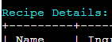

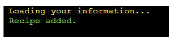

### Table
I used the [Pretty Table](https://pypi.org/project/prettytable/) website to create a user friendly viewing of the recipes.

## USER EXPERIENCE (UX)
* The user has a clear view of the application. 
* The main page has a brief but very explanatory paragraph of what the application is about.
* The menus are clear and simple, with choices easy to read.
* The colors have a pattern so the user can identify easily what the program is doing when a choice is made.
* The tables with the recipes are organized and easy to read.
* If the user enters an invalid option he will be prompted.
* At the end of each option, the user will see the “next move” option which will allow him to go back to the main page or exit the program.

## TESTING

### Code Validation
[PEP8 Validation Tool](https://pep8ci.herokuapp.com/) was used to validate the code. A few errors about trailing whitespaces, indentation and long lines appeared but they were easily fixed. The only ones that remained are:
*  line 324 - I couldn’t shorten the line.
* line 424 onward - the trailing whitespaces and the invalid sequences are related to the ASCII art.

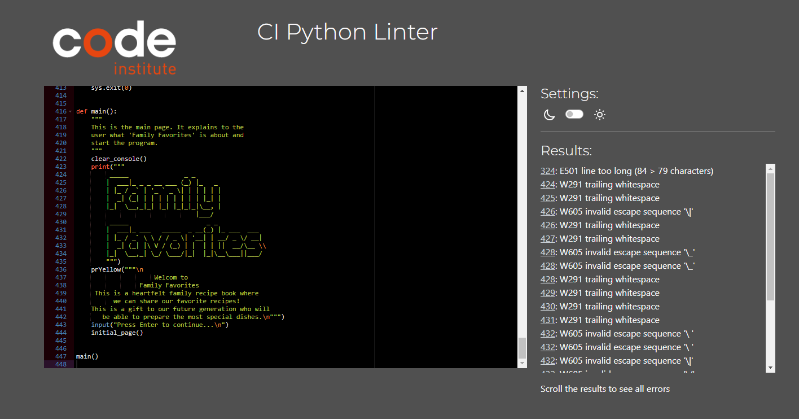

### Manual Testing
See below the manual testing I did. Apparently it’s all working fine.

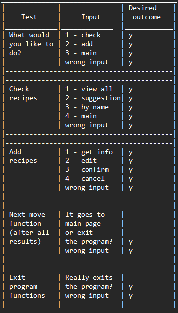

* I inspired myself on the table I saw in this project [here](https://github.com/LauraMayock/who-wants-Ice-cream/blob/main/README.md)

### Bugs Fixed

Some things along the way were hard for me to figure out. I used Google and ChatGPT to help me. See below when the parts of the code that was showing some problem:

* I wrote quite a big code to the “edit recipe” option but I just tested it in the first two options to edit (e.g. name and recipe name) and didn’t realize that it wasn’t working on a loop to edit the other options. So, if the user chooses, for example, to edit the ingredients first, it would give me an error. I decided then to fix it but I didn’t know where to begin. I explained everything to ChatGPT and it gave me the idea of simplifying the options and using the variable “or” instead of writing long lines of code for each option. This way, the user can edit the information and it will loop editing until the user enters “confirm”.

* I saw my colleagues' projects and they used tabulate libraries to do the tables’ styles and I found it very interesting. I tried to use it but unfortunately, I wasn’t able to set up properly. My table was being print all disorganized with very crooked lines. So I used the Pretty Tables, other library I saw in my colleagues projects, but it wasn’t working as well. This time I put it on ChatGPT and it taught me to put the “max-width” which worked very well for me. I also used [this](https://pypi.org/project/prettytable/) website to learn about how to use Pretty Tables.

* To clear the screen I used [this](https://www.geeksforgeeks.org/clear-screen-python/) website, which was working all good, but suddenly it stopped working. I used [this](https://www.codeproject.com/Questions/5297117/I-have-been-getting-the-error-sh-1-cls-not-found-a#:~:text=Solution%201&text=You%20are%20trying%20to%20run,or%20command%20prompt%20on%20Windows.&text=C%2B%2B-,system(%22cls%22)%3B,MacOSX%2C%20you%20can%20try%20clear%20) solution - I changed “cls” for “clear” and it worked. After that, I was worried that it could stop working and ChatGPT taught me to put the following: 'clear' if os.name == 'posix' else 'cls'. So, hopefully, it will work better in all occasions.

* I had trouble trying to add some colors to the console. When I tried using colorama but it was a mess as, for example, if I put one sentence in red, then all code after that would be also red. So I used the ANSI Code, building functions to call for the color as instructed [here](https://www.geeksforgeeks.org/print-colors-python-terminal/)

## DEPLOYMENT

This project was deployed using Code Institute’s mock terminal for Heroku. I followed the steps of the Love Sandwiches walkthrough:

* The code was set up in Codeanywhere platform, using the Code Institute’s template.
* I pushed and committed all changes to github.
* I signed up and logged into the Heroku account and clicked the “new app” button.
* I added 2 build packs: python and nodejs.
* I connected my GitHub account to get my project.
* I clicked on the “config vars” button to hide any sensitive files - which was the CREDS.JSON with the spreadsheet content.
* I deployed my project manually.
* I noticed that it wasn’t recognizing the Pretty Table library even though it was properly installed, so after doing some google search, I could see what was the problem and fixed it - it wasn’t in my requirements file, so I just added it and it worked fine.
* After deploying, I noticed some small mistakes along the code, so I fixed it and tested deploying manually again. Now the automatic deployment is also enabled.

## CREDITS

### Colleagues

* When I started the project I was wondering how to organize the code so the users could get a clear view of the choices I wanted. I read a lot of projects and the [“Pasta La Vista”](https://github.com/TeodoraAlina/pasta-la-vista/blob/main/run.py) from Teodora Alina inspired me to write it. See below the specific part of her code I got to write mine:

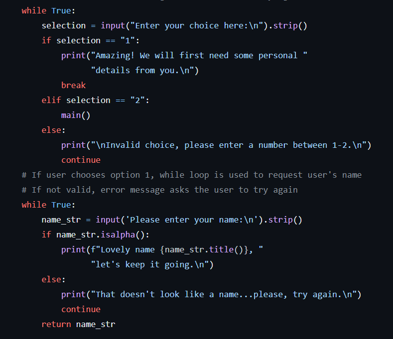

* Among many things I was inspired by the project [“Kennel Mate”](https://github.com/rstan-dev/P3-Kennel-Mate/blob/main/run.py) by “rstan-dev”, I got the following part of his code to write mine in the “add  recipe” function: 

* I was very inspired by the [“Who wants icecream”](https://github.com/LauraMayock/who-wants-Ice-cream/blob/main/README.md) project by my amazing cohort Laura Mayock who has being really kind, understanding and helpful while I was creating this project. I did this (#manual-testing) table looking at her README and also got names of some libraries looking at her work, such as Pretty Tables, Colorama and Patorjk.

### Websites

* The “exit program” function was taken from this website - [FreeCodeCamp](https://www.freecodecamp.org/news/python-exit-how-to-use-an-exit-function-in-python-to-stop-a-program/#:~:text=The%20exit()%20function%20in,immediately%20stop%20running%20and%20exit)

* Free Code Camp also helped me to understand the logic behind connecting the API and using the spreadsheet [here](https://www.freecodecamp.org/news/how-to-create-read-update-and-search-through-excel-files-using-python-c70680d811d4/#:~:text=How%20to%20create%2C%20read%2C%20update%20and%20search%20through,and%20basic%20info%20...%206%20Wrapping%20up%20)

* I was having trouble trying to update specific cells in the spreadsheet, so I used [this](https://docs.gspread.org/en/latest/user-guide.html#updating-cells) website to learn about it and it worked alright.

* I also used [W3School](https://www.w3schools.com/) a lot.

* [Geeks for Geeks](https://www.geeksforgeeks.org/python-random-module/) also helped a lot to understand how to build a function to show random recipes.

* As described before, I also used chatGPT when I felt stuck. For me, it's an amazing tool because not everytime I knew how to google the problem I was having. In chatGPT I could narrate and explain what was happening and ask for website and contents related to it. It really helped me to study.

* Code Institute’s Love Sandwiches project was essential. I learned a lot from it.
